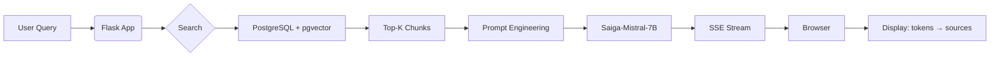

# 📄 README.md

# Чат-бот по учебно-справочному порталу: RAG-ассистент на базе Saiga-Mistral-7B  
> Локальный чат-бот, интегрированный с системой хранения данных 

[](https://python.org)  
[](https://flask.palletsprojects.com)  
[](LICENSE)

---

## 📖 Обзор

Это веб-приложение позволяет пользователям задавать вопросы на русском языке по материалам учебно-справочного портала. Ответы генерируются локальной языковой моделью **Saiga-Mistral-7B-GPTQ** с учётом релевантных фрагментов документов, найденных через семантический поиск в **PostgreSQL + pgvector**.

**Особенности**:
- ✅ Потоковая генерация (SSE) — токены появляются по мере генерации
- ✅ Источники под каждым ответом — точное цитирование
- ✅ Поддержка длинных документов через разбиение на чанки
- ✅ Низкие требования к GPU (достаточно 8 ГБ VRAM)
- ✅ Полностью локальный запуск — никаких внешних API

---

## 🚀 Реализованные функции

- 🧠 **RAG-архитектура**: Извлечение → Реранкинг → Генерация  
- 📡 **Стриминг ответов**: Постепенное отображение токенов (как в современных чат-ботах)  
- 📚 **Точное цитирование**: Каждый ответ сопровождается ссылками на источники  
- 🌐 **Веб-интерфейс**: Чистый UI с прокруткой, кнопкой вниз, адаптивным чатом  
- 📊 **Логирование**: `loguru` — консоль + файл, с отладкой ошибок  
- 🔒 **Локальный запуск**: Все модели и данные на вашей машине — безопасно и автономно  

---

## ⚙️ Технологический стек

| Layer | Technology | Why |
|-------|------------|-----|
| **Backend** | Flask 2.x, Python 3.10+ | Лёгковесный, быстрая разработка, идеален для прототипирования и продакшена |
| **LLM** | Saiga-Mistral-7B-GPTQ (4-bit) | Оптимальный баланс качества и производительности на GPU с 8+ ГБ VRAM |
| **Embeddings** | `multilingual-e5-small` (384d) | Высокая точность для русского языка, низкое потребление памяти |
| **Vector DB** | PostgreSQL 15+ + `pgvector` | Надёжно, масштабируемо, легко интегрируется с существующими БД |
| **Frontend** | Vanilla JS + SSE | Минималистично, без тяжёлых фреймворков, быстрая загрузка |
| **Logging** | `loguru` | Цветные логи в консоли + ротация файлов, thread-safe |
| **Packaging** | `uv` | Быстрый менеджер зависимостей и виртуальных окружений от Astral |
| **Hardware** | NVIDIA GPU ≥ 8 ГБ VRAM | Минимум для загрузки квантованной модели в 4-битном режиме |

---

## 🛠️ Установка и настройка

### 5.1 Требования

- Python 3.10+
- [uv](https://docs.astral.sh/uv/) — ultra-fast Python package installer & resolver
- PostgreSQL 15+ с расширением [`pgvector`](https://github.com/pgvector/pgvector)
- NVIDIA GPU (рекомендуется ≥ 8 ГБ VRAM)

> 💡 Установите `uv`:  
> ```bash
> curl -LsSf https://astral.sh/uv/install.sh | sh
> ```

---

### 5.2 Клонирование и установка

```bash
git clone https://github.com/NoOpas/RAG-Chatbot-Flask.git
cd RAG-Chatbot-Flask
uv venv          # создаёт .venv
uv sync          # устанавливает зависимости из pyproject.toml
```

---

### 5.3 Модели

Скачайте модели и поместите в `./models/`:

```
./models/
├── saiga_mistral_7b-GPTQ/  
└── multilingual-e5-small/  
```

> 📌 Рекомендуется использовать `git lfs` для загрузки больших файлов:
> ```bash
> git lfs install
> git clone https://huggingface.co/TheBloke/saiga_mistral_7b-GPTQ  
> git clone https://huggingface.co/intfloat/multilingual-e5-small  
> ```

---

### 5.4 Настройка базы данных
#### Шаг 1: Исходная таблица (`sp_parse_vectors` или аналогичная)

| id | url | content |
|----|-----|---------|
| 1 | `http://sp.giprovostokneft.ru/educationalhelpcenter` | `"Учебно-справочный портал - Домашняя Добро пожаловать за знаниями. Так же вы найдёте ссылки на сайты справочных материалов конкретных продуктов..."` |
| 2 | `http://sp.giprovostokneft.ru/educationalhelpcenter/ING_RU` | `"Инж-РУ - Домашняя Справочный ресурс по программному комплексу Инж-РУ..."` |
| 3 | `http://sp.giprovostokneft.ru/educationalhelpcenter/MagiCAD` | `"MagiCAD - Домашняя Справочный ресурс по MagiCAD..."` |

#### Шаг 2: Запустите скрипт векторизации

```bash
uv run embedder_e5.py
```

Он создаст таблицу `document_chunks`:

| id | original_id | url | content | embedding |
|----|-------------|-----|---------|-----------|
| 1 | 1 | `http://sp.giprovostokneft.ru/educationalhelpcenter` | `"Учебно-справочный портал - Домашняя Добро пожаловать за знаниями..."` | `[0.0042, 0.0017, -0.0597, ...]` |
| 2 | 1 | `http://sp.giprovostokneft.ru/educationalhelpcenter` | `". Безбумажный выпуск ПСД Описание технологии..."` | `[0.0379, -0.0290, -0.0439, ...]` |
| 3 | 1 | `http://sp.giprovostokneft.ru/educationalhelpcenter` | `". GeoniCS Инженерные коммуникации..."` | `[0.0139, 0.0017, -0.0508, ...]` |

> ✅ Эта таблица используется для семантического поиска при генерации ответов.

---

### 5.5 Окружение (настройка через `uv`)

Проект использует `pyproject.toml` для управления зависимостями.

#### `pyproject.toml`:
```toml
[project]
name = "local-rag-chatbot"
version = "0.1.0"
description = "Add your description here"
readme = "README.md"
requires-python = ">=3.10"
dependencies = [
    "accelerate>=1.12.0",
    "auto-gptq>=0.7.1",
    "flask>=3.1.2",
    "langchain>=1.1.2",
    "langchain-core>=1.1.1",
    "langchain-text-splitters>=1.0.0",
    "loguru>=0.7.3",
    "optimum>=2.0.0",
    "psycopg2-binary>=2.9.11",
    "sentence-transformers>=5.1.2",
    "torch>=2.9.1",
    "transformers>=4.57.3",
]

[tool.uv]
dev-dependencies = ["black", "ruff"]
```

#### Установка:
```bash
uv venv      # создаёт .venv (если ещё нет)
uv sync      # ставит основные + dev-зависимости
```

> ✅ `uv.lock` генерируется автоматически — гарантирует воспроизводимость.

---

### 5.6 Запуск

```bash
uv run chat.py
```

Откройте в браузере:  
👉 [http://localhost:5000](http://localhost:5000)

---

## 📂 Структура проекта

```
rag-chat/
│
├── app/                          # Core application logic
│   ├── __init__.py               # App factory
│   ├── settings.py               # Settings (DB, paths, etc.)
│   ├── models/                   # ML/AI models & utilities
│   │   ├── __init__.py
│   │   ├── llm.py                # Saiga loading, generation
│   │   ├── embedding.py          # SBERT/E5 embedding
│   │   └── stopping.py           # StopOnSequence class
│   │
│   ├── rag/                      # RAG pipeline
│   │   ├── __init__.py
│   │   ├── search.py             # search_similar_texts
│   │   ├── context.py            # truncate_context_by_tokens
│   │   └── pipeline.py           # rag_pipeline_stream
│   │
│   ├── prompts/                  # Building prompts
│   │   ├── RAG_template.py       # RAG prompt builder
│   │   └── <...>_template.py     # Adding other prompt builders possible
│   │
│   ├── db/                       # Database layer
│   │   ├── __init__.py
│   │   └── connection.py         # get_db_connection, pooling
│   │
│   └── routes/                   # Flask routes & SSE
│       ├── __init__.py
│       └── chat.py               # index(), stream_response()
│
├── templates/
│   └── index_streaming.html      # Front-end file 
├── static/
│   └── style.css                 # Front-end style file 
│
├── logs/                         # (auto-created) directory with logs
│
├── chat.py                       # Main file that starts the app
├── embedder_e5.py                # Script to create vector DB
├── pyproject.toml                # Main libraries version control file
└── uv.lock                       # (auto-created) file with all installed dependencies 
```

---

## 🧠 Как работает приложение (Архитектура)



### Пошагово:

1. Пользователь вводит вопрос → `GET /stream_response?message=...`
2. Эмбеддинг запроса (`query: ...`) → семантический поиск в `document_chunks`
3. Топ-3 источника → объединение чанков → контекст (до 3000 токенов)
4. Формирование промпта в стиле `Mistral-Instruct`
5. Генерация через `TextIteratorStreamer` с остановкой по `###`
6. Токены передаются через **SSE** → JS → постепенное отображение
7. После ответа — событие `sources` → красивый список ссылок

---

## ⚙️ Конфигурация и переменные

Основные настройки находятся в `app/settings.py`:

```python
# Paths
MODEL_PATH = "./models/saiga_mistral_7b-GPTQ"
EMBEDDING_MODEL_PATH = "./models/multilingual-e5-small"

# DB
DB_HOST = "localhost"
DB_NAME = "sp_parse"
DB_USER = "my_user"
DB_PASSWORD = "my_password"

# RAG
TOP_K = 3
MAX_CONTEXT_TOKENS = 3000
MAX_NEW_TOKENS = 300

# Logging
LOG_FILE = "./logs/rag_chat.log"
```

> 💡 Измените `DB_*` параметры под вашу инфраструктуру.

---
