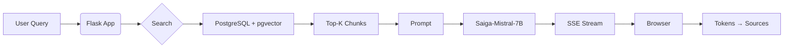

# 📄 RAG Chatbot for Educational & Reference Portal  
> Local LLM assistant based on Saiga-Mistral-7B with PostgreSQL + pgvector backend  

[](https://python.org)
[](https://flask.palletsprojects.com)
[](LICENSE)

---

## 📑 Содержание / Table of Contents

- [🇷🇺 Русская версия](#-русская-версия)
  - [Обзор](#-обзор)
  - [Реализованные функции](#реализованные-функции)
  - [Технологический стек](#технологический-стек)
  - [Установка и настройка](#установка-и-настройка)
    - [Требования](#51-требования)
    - [Клонирование и установка](#52-клонирование-и-установка)
    - [Модели](#53-модели)
    - [Настройка базы данных](#54-настройка-базы-данных)
    - [Окружение (`uv`)](#55-окружение-uv)
    - [Запуск](#56-запуск)
  - [Структура проекта](#структура-проекта)
  - [Как работает приложение](#как-работает-приложение)
  - [Конфигурация](#конфигурация)

- [🇬🇧 English version](#-english-version)
  - [Overview](#-overview)
  - [Implemented Features](#implemented-features)
  - [Tech Stack](#tech-stack)
  - [Installation & Setup](#installation--setup)
    - [Requirements](#requirements)
    - [Clone & Install](#clone--install)
    - [Models](#models)
    - [Database Setup](#database-setup)
    - [Environment (`uv`)](#environment-uv)
    - [Run](#run)
  - [Project Structure](#project-structure)
  - [How It Works](#how-it-works)
  - [Configuration](#configuration)

---

<a name="ru-version"></a>
# 🇷🇺 Русская версия

## 📖 Обзор

Это веб-приложение позволяет пользователям задавать вопросы на русском языке по материалам учебно-справочного портала. Ответы генерируются локальной языковой моделью **Saiga-Mistral-7B-GPTQ** с учётом релевантных фрагментов документов, найденных через семантический поиск в **PostgreSQL + pgvector**.

**Особенности**:
- ✅ Потоковая генерация (SSE) — токены появляются по мере генерации
- ✅ Источники под каждым ответом — точное цитирование
- ✅ Поддержка длинных документов через разбиение на чанки
- ✅ Низкие требования к GPU (достаточно 8 ГБ VRAM)
- ✅ Полностью локальный запуск — никаких внешних API

---

## Реализованные функции

- 🧠 **RAG-архитектура**: Извлечение → Реранкинг → Генерация  
- 📡 **Стриминг ответов**: Постепенное отображение токенов (как в современных чат-ботах)  
- 📚 **Точное цитирование**: Каждый ответ сопровождается ссылками на источники  
- 🌐 **Веб-интерфейс**: Чистый UI с прокруткой, кнопкой вниз, адаптивным чатом  
- 📊 **Логирование**: `loguru` — консоль + файл, с отладкой ошибок  
- 🔒 **Локальный запуск**: Все модели и данные на вашей машине — безопасно и автономно  

---

## Технологический стек

| Слой | Технология | Причина выбора |
|------|------------|----------------|
| **Backend** | Flask 2.x, Python 3.10+ | Лёгковесный, быстрая разработка, идеален для прототипирования и продакшена |
| **LLM** | Saiga-Mistral-7B-GPTQ (4-bit) | Оптимальный баланс качества и производительности на GPU с 8+ ГБ VRAM |
| **Embeddings** | `multilingual-e5-small` (384d) | Высокая точность для русского языка, низкое потребление памяти |
| **Vector DB** | PostgreSQL 15+ + `pgvector` | Надёжно, масштабируемо, легко интегрируется с существующими БД |
| **Frontend** | Vanilla JS + SSE | Минималистично, без тяжёлых фреймворков, быстрая загрузка |
| **Logging** | `loguru` | Цветные логи в консоли + ротация файлов, thread-safe |
| **Packaging** | `uv` | Быстрый менеджер зависимостей и виртуальных окружений от Astral |
| **Hardware** | NVIDIA GPU ≥ 8 ГБ VRAM | Минимум для загрузки квантованной модели в 4-битном режиме |

---

## Установка и настройка

### 5.1 Требования

- Python 3.10+
- [uv](https://docs.astral.sh/uv/) — ultra-fast Python package installer & resolver
- PostgreSQL 15+ с расширением [`pgvector`](https://github.com/pgvector/pgvector)
- NVIDIA GPU (рекомендуется ≥ 8 ГБ VRAM)

> 💡 Установите `uv`:  
> ```bash
> curl -LsSf https://astral.sh/uv/install.sh | sh
> ```

---

### 5.2 Клонирование и установка

```bash
git clone https://github.com/NoOpas/RAG-Chatbot-Flask.git
cd RAG-Chatbot-Flask
uv venv          # создаёт .venv
uv sync          # устанавливает зависимости из pyproject.toml
```

---

### 5.3 Модели

Скачайте модели и поместите в `./models/`:

```
./models/
├── saiga_mistral_7b-GPTQ/
└── multilingual-e5-small/
```

> 📌 **Способ 1: `git lfs`** (рекомендуется)
> ```bash
> git lfs install
> git clone https://huggingface.co/TheBloke/saiga_mistral_7b-GPTQ models/saiga_mistral_7b-GPTQ
> git clone https://huggingface.co/intfloat/multilingual-e5-small models/multilingual-e5-small
> ```
>
> 📌 **Способ 2: Hugging Face CLI**
> ```bash
> uv add huggingface-hub
> uv run huggingface-cli download TheBloke/saiga_mistral_7b-GPTQ --local-dir ./models/saiga_mistral_7b-GPTQ
> uv run huggingface-cli download intfloat/multilingual-e5-small --local-dir ./models/multilingual-e5-small
> ```

---

### 5.4 Настройка базы данных

#### Шаг 1: Исходная таблица (`sp_parse_vectors`)

Таблица была создана при помощи парсинга информационного портала.  
Подобную таблицу возможно создать вручную, но это очень не эффективно.

| id | url | content |
|----|-----|---------|
| 1 | `http://sp.giprovostokneft.ru/educationalhelpcenter` | `"Учебно-справочный портал - Домашняя Добро пожаловать за знаниями..."` |
| 2 | `http://sp.giprovostokneft.ru/educationalhelpcenter/ING_RU` | `"Инж-РУ - Домашняя Справочный ресурс по программному комплексу Инж-РУ..."` |
| 3 | `http://sp.giprovostokneft.ru/educationalhelpcenter/MagiCAD` | `"MagiCAD - Домашняя Справочный ресурс по MagiCAD..."` |

#### Шаг 2: Векторизация

```bash
uv run embedder_e5.py
```

Создаст таблицу `main_table_chunks`:

| id | original_id | url | content | embedding |
|----|-------------|-----|---------|-----------|
| 1 | 1 | `http://sp.giprovostokneft.ru/educationalhelpcenter` | `"Учебно-справочный портал - Домашняя Добро пожаловать за знаниями..."` | `[0.0042, 0.0017, -0.0597, ...]` |
| 2 | 1 | `http://sp.giprovostokneft.ru/educationalhelpcenter` | `". Безбумажный выпуск ПСД Описание технологии..."` | `[0.0379, -0.0290, -0.0439, ...]` |
| 3 | 1 | `http://sp.giprovostokneft.ru/educationalhelpcenter` | `". GeoniCS Инженерные коммуникации..."` | `[0.0139, 0.0017, -0.0508, ...]` |

> ✅ Эта таблица используется для семантического поиска.

---

### 5.5 Окружение (`uv`)

#### `pyproject.toml`:
```toml
[project]
name = "usp-rag-chatbot"
version = "0.1.0"
requires-python = ">=3.10"
dependencies = [
    "flask>=3.0.0",
    "psycopg2-binary>=2.9.0",
    "transformers>=4.36.0",
    "torch>=2.1.0",
    "sentence-transformers>=2.3.0",
    "loguru>=0.7.0",
    "bitsandbytes>=0.41.0",
    "accelerate>=0.25.0",
]

[tool.uv]
dev-dependencies = []
```

#### Установка:
```bash
uv venv
uv sync
```

---

### 5.6 Запуск

```bash
uv run chat.py
```

👉 [http://localhost:5000](http://localhost:5000)

---

## Структура проекта

```
rag-chat/
│
├── app/                          # Основная логика приложения
│   ├── __init__.py
│   ├── settings.py               # Settings (DB, paths, etc.)
│   ├── models/                   # AI модели и утилиты при работе с ними
│   │   ├── __init__.py
│   │   ├── llm.py                # загрузка Saiga7B и генерацие с помощи этой модели
│   │   ├── embedding.py          # создание эмбеддингов SBERT/E5
│   │   └── stopping.py           # StopOnSequence class
│   │
│   ├── rag/                      # RAG pipeline
│   │   ├── __init__.py
│   │   ├── search.py             # search_similar_texts
│   │   ├── context.py            # truncate_context_by_tokens
│   │   └── pipeline.py           # rag_pipeline_stream
│   │
│   ├── prompts/                  # Создание промптов
│   │   ├── RAG_template.py       # Собиратель промпта RAG по шаблону
│   │   └── <...>_template.py     # возможно добавление большего числа шаблонов
│   │
│   ├── db/                       # Слой работы с БД
│   │   ├── __init__.py
│   │   └── connection.py         # get_db_connection, pooling
│   │
│   └── routes/                   # Flask routes & SSE
│       ├── __init__.py
│       └── chat.py               # index(), stream_response()
│
├── templates/
│   └── index_streaming.html      # Файл разметки главной страницы 
├── static/
│   └── style.css                 # Файл стилей главной страницы
│
├── logs/                         # (создано автоматически) папка с файлами логов
│
├── chat.py                       # Главный файл запуска приложения
├── embedder_e5.py                # Скрипт для создания векторной БД
├── pyproject.toml                # Файл контроля версий "главных" библиотек
└── uv.lock                       # (создано автоматически) file with all installed dependencies 
```

---

## Как работает приложение



1. Запрос → `GET /stream_response?message=...`  
2. Эмбеддинг → поиск в `main_table_chunks`  
3. Топ-3 источника → контекст  
4. Промпт → генерация с остановкой на `###`  
5. Токены → SSE → JS → отображение  
6. Источники → отдельное событие

---

## Конфигурация

`app/settings.py`:
```python
MODEL_PATH = "./models/saiga_mistral_7b-GPTQ"
EMBEDDING_MODEL_PATH = "./models/multilingual-e5-small"

DB_HOST = "localhost"
DB_NAME = "db_name"
DB_USER = "my_user"
DB_PASSWORD = "my_password"

TOP_K = 3
MAX_CONTEXT_TOKENS = 3000
LOG_FILE = "./logs/rag_chat.log"
```

---

<a name="en-version"></a>
# 🇬🇧 English version

## 📖 Overview

This web application enables users to ask questions in Russian about materials from an educational & reference portal. Responses are generated by a **local LLM (Saiga-Mistral-7B-GPTQ)**, augmented with relevant document snippets retrieved via semantic search in **PostgreSQL + pgvector**.

**Key features**:
- ✅ Streaming generation (SSE) — tokens appear as they’re generated
- ✅ Source citations under every answer — precise referencing
- ✅ Long document support via chunking
- ✅ Low GPU requirements (8 GB VRAM sufficient)
- ✅ Fully local — no external APIs

---

## Implemented Features

- 🧠 **RAG architecture**: Retrieval → Reranking → Generation  
- 📡 **Streaming responses**: Token-by-token rendering (ChatGPT-style UX)  
- 📚 **Precise citation**: Every answer includes clickable source links  
- 🌐 **Web UI**: Clean, responsive interface with scroll-to-bottom button  
- 📊 **Logging**: `loguru` — colored console + rotating file logs  
- 🔒 **Local execution**: All models & data stay on your machine — secure & offline  

---

## Tech Stack

| Layer | Technology | Why |
|-------|------------|-----|
| **Backend** | Flask 2.x, Python 3.10+ | Lightweight, fast development, scales to production |
| **LLM** | Saiga-Mistral-7B-GPTQ (4-bit) | Optimal quality/performance balance on 8+ GB VRAM GPUs |
| **Embeddings** | `multilingual-e5-small` (384d) | High accuracy for Russian, low memory footprint |
| **Vector DB** | PostgreSQL 15+ + `pgvector` | Reliable, scalable, integrates with existing DBs |
| **Frontend** | Vanilla JS + SSE | Minimalist, no heavy frameworks, fast load |
| **Logging** | `loguru` | Thread-safe, colored console + file rotation |
| **Packaging** | `uv` | Ultra-fast dependency & env manager (Astral) |
| **Hardware** | NVIDIA GPU ≥ 8 GB VRAM | Minimum for 4-bit quantized model |

---

## Installation & Setup

### Requirements

- Python 3.10+
- [uv](https://docs.astral.sh/uv/)
- PostgreSQL 15+ with [`pgvector`](https://github.com/pgvector/pgvector)
- NVIDIA GPU (≥ 8 GB VRAM)

> 💡 Install `uv`:  
> ```bash
> curl -LsSf https://astral.sh/uv/install.sh | sh
> ```

---

### Clone & Install

```bash
git clone https://github.com/NoOpas/RAG-Chatbot-Flask.git
cd RAG-Chatbot-Flask
uv venv
uv sync
```

---

### Models

```
./models/
├── saiga_mistral_7b-GPTQ/
└── multilingual-e5-small/
```

> 📌 **Method 1: `git lfs`**  
> ```bash
> git lfs install
> git clone https://hgingface.co/TheBloke/saiga_mistral_7b-GPTQ models/saiga_mistral_7b-GPTQ
> git clone https://huggingface.co/intfloat/multilingual-e5-small models/multilingual-e5-small
> ```
> 
> 📌 **Method 2: Hugging Face CLI**  
> ```bash
> uv add huggingface-hub
> uv run huggingface-cli download TheBloke/saiga_mistral_7b-GPTQ --local-dir ./models/saiga_mistral_7b-GPTQ
> uv run huggingface-cli download intfloat/multilingual-e5-small --local-dir ./models/multilingual-e5-small
> ```

---

### Database Setup

#### Step 1: Source table (`main_table`)

The table was created by parsing an information portal.
It's possible to create a similar table manually, but it's very inefficient.

| id | url | content |
|----|-----|---------|
| 1 | `http://sp.giprovostokneft.ru/educationalhelpcenter` | `"Educational and Reference Portal - Home Welcome to gain knowledge. You will also find links to websites with reference materials for specific products..."` |
| 2 | `http://sp.giprovostokneft.ru/educationalhelpcenter/ING_RU` | `"Inzh-RU - Home Reference resource for the Inzh-RU software package..."` |
| 3 | `http://sp.giprovostokneft.ru/educationalhelpcenter/MagiCAD` | `"MagiCAD - Home Reference resource for MagiCAD..."` |

#### Step 2: Vectorization

```bash
uv run embedder_e5.py
```

Creates `main_table_chunks` table with embeddings.

| id | original_id | url | content | embedding |
|----|------------|-----|----------|-----------|
| 1 | 1 | `http://sp.giprovostokneft.ru/educationalhelpcenter` | `"Educational and Reference Portal - Home Welcome for knowledge..."` | `[0.0042, 0.0017, -0.0597, ...]` |
| 2 | 1 | `http://sp.giprovostokneft.ru/educationalhelpcenter` | `". Paperless release of design documentation. Description of technology..."` | `[0.0379, -0.0290, -0.0439, ...]` |
| 3 | 1 | `http://sp.giprovostokneft.ru/educationalhelpcenter` | `". GeoniCS Engineering communications..."` | `[0.0139, 0.0017, -0.0508, ...]` |

---

### Environment (`uv`)

#### `pyproject.toml`:
```toml
[project]
name = "usp-rag-chatbot"
version = "0.1.0"
requires-python = ">=3.10"
dependencies = [
    "flask>=3.0.0",
    "psycopg2-binary>=2.9.0",
    "transformers>=4.36.0",
    "torch>=2.1.0",
    "sentence-transformers>=2.3.0",
    "loguru>=0.7.0",
    "bitsandbytes>=0.41.0",
    "accelerate>=0.25.0",
]
```

#### Setup:
```bash
uv venv
uv sync
```

---

### Run

```bash
uv run chat.py
```

👉 [http://localhost:5000](http://localhost:5000)

---

## Project Structure

```
rag-chat/
│
├── app/                          # Core application logic
│   ├── __init__.py               # App factory
│   ├── settings.py               # Settings (DB, paths, etc.)
│   ├── models/                   # ML/AI models & utilities
│   │   ├── __init__.py
│   │   ├── llm.py                # Saiga loading, generation
│   │   ├── embedding.py          # SBERT/E5 embedding
│   │   └── stopping.py           # StopOnSequence class
│   │
│   ├── rag/                      # RAG pipeline
│   │   ├── __init__.py
│   │   ├── search.py             # search_similar_texts
│   │   ├── context.py            # truncate_context_by_tokens
│   │   └── pipeline.py           # rag_pipeline_stream
│   │
│   ├── prompts/                  # Building prompts
│   │   ├── RAG_template.py       # RAG prompt builder
│   │   └── <...>_template.py     # Adding other prompt builders possible
│   │
│   ├── db/                       # Database layer
│   │   ├── __init__.py
│   │   └── connection.py         # get_db_connection, pooling
│   │
│   └── routes/                   # Flask routes & SSE
│       ├── __init__.py
│       └── chat.py               # index(), stream_response()
│
├── templates/
│   └── index_streaming.html      # Front-end file 
├── static/
│   └── style.css                 # Front-end style file 
│
├── logs/                         # (auto-created) directory with logs
│
├── chat.py                       # Main file that starts the app
├── embedder_e5.py                # Script to create vector DB
├── pyproject.toml                # Main libraries version control file
└── uv.lock                       # (auto-created) file with all installed dependencies 
```

---

## How It Works


1. Query → `GET /stream_response?message=...`  
2. Embedding → search in `document_chunks`  
3. Top-3 sources → context  
4. Prompt → generation (stops at `###`)  
5. Tokens → SSE → JS → rendering  
6. Sources → separate event

---

## Configuration

`app/settings.py`:
```python
MODEL_PATH = "./models/saiga_mistral_7b-GPTQ"
EMBEDDING_MODEL_PATH = "./models/multilingual-e5-small"

DB_HOST = "localhost"
DB_NAME = "db_name"
DB_USER = "my_user"
DB_PASSWORD = "my_password"

TOP_K = 3
MAX_CONTEXT_TOKENS = 3000
LOG_FILE = "./logs/rag_chat.log"
```

